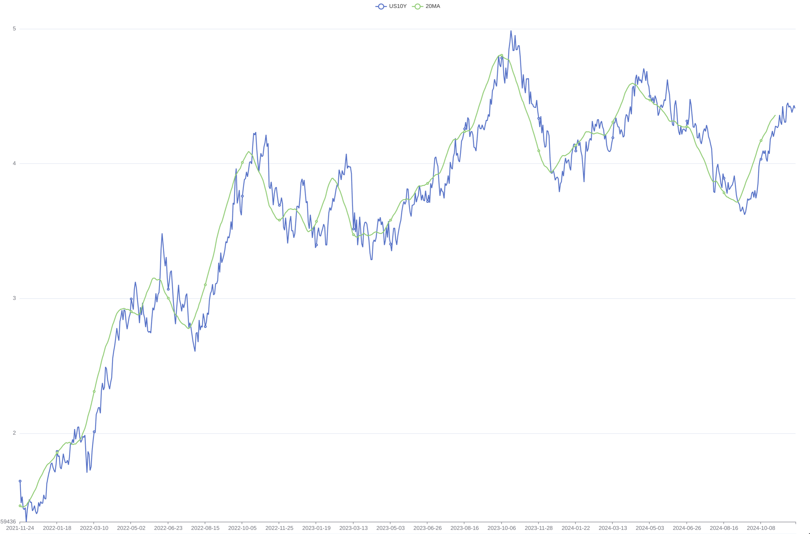

# The moving average

## Moving Average

To make indicators appear smoother, we can look at data crossing the MA (Moving Average) line to obtain trading signals.

## Problems Encountered

1. We observe that the algorithm causes indicators to lag. The higher the value of the MA, the more it lags.
2. There will be a lot of noisy signals after high-frequency fluctuations, similar to when the monitored target frequently crosses the threshold during routine monitoring. We need to add a reasonable Trigger Cooldown time.
3. The frequency of valid signals is too low. If our goal is medium to high-frequency trading, this type of signal presents a significant challenge to the efficiency of capital utilization.

## Next Analysis

Next, we want to examine how purchasing BTC based on these signals impacts returns. However, I need to be very careful to avoid overfitting.

## Moving average

让指标看起来更加平滑, 我们可以看数据穿过MA数据线获取交易信号. 

## 遇到的问题

1. 我们可以看到算法会导致指标滞后, MA的值越越滞后
2. 在高频度的震动之后会有很多杂乱的信号. 有点类似于平时做监控的时候被监控目标频繁穿过阈值, 我们需要添加一个合理的 Trigger Cooldown时间. 
3. 有效信号频率过低. 如果我们的目标是中高频的交易, 显然这种信号对资金使用的效率构成很大的挑战. 

## 接下来的分析

接下来我们要结合 BTC 的价格看看通过信号购买 BTC 的收益如何. 
但是我需要十分小心 Overfit
